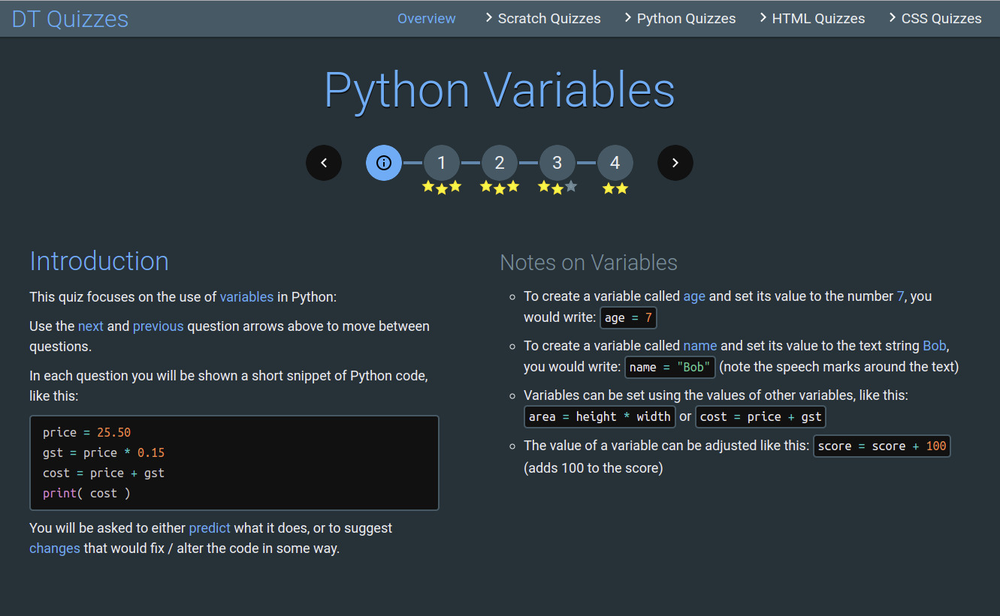

# Quiz

A formative assessment quiz app that show a series of questions and multiple-choice answers, guiding students to the correct answer as needed (but tracking initial answers to help assess mastery). Intended to help with Digital Technologies coding courses, but could be used for any topic.


Demo here: https://stevecopley.github.io/quiz/

Syntax-highlighted code snippets within questions and answers were one of the motivations for making this (there are no shortage of other quiz things out there). Most coding languages are supported via the [Prism syntax highlighting library](https://github.com/PrismJS/prism/). Additionally, the [Scratch](https://scratch.mit.edu/about) block language has good support (see [below](#scratch-support))



The quiz works well on mobile devices too, allowing students to revise when away from a computer.


## Grading and Feedback

The grading and feedback is intended for students to self-assess. As such it is not centrally recorded (I might add this in a future update). Instead, students simply see their progress in the form of stars:


A question answered correctly, first-time gains maximum stars. Each incorrect answer means the loss of a star, down to a minimum of one when the question is finally answered correctly (every one's a winner!)

Upon answering a question corectly, feedback can be shown (this is also subsequently shown when an answered question is re-visited):


## Overview

An overview screen shows the status of any quizzes in-progress, and gives a percentage grade (stars gained / stars available):


# Quiz & Question File Format

All quizzes are written using **Markdown**. Place quiz file in to the **quizzes** folder (can be within sub-folders by topic). List the quiz in **list.json**. (The main menu is generated from the contents of this file.)

The format of a quiz is as follows:

```markdown
# Quiz Title

--
language


-------------------------------------------------
## Introduction

Section of text / info / notes re. the quiz

--
Second (optional) section of text re. the quiz


-------------------------------------------------
## Q1 Title

The question, including code snippets, etc.

--
Info concerning the answers, then a list of answers (from two to four):

1. First answer (this should be the **correct** one)
2. Second answer
3. Third answer (optional)
4. Forth answer (optional)

--
Feedback to present when the correct answer is given


-------------------------------------------------
## Q2 Title

Etc...
```

Note: The '--' separators are *not* valid Markdown, but serve as a clear indicator between sections

The answers will always be displayed to the user in a *random order*. The order of the answers in the Markdown file is only important in that the **correct** answer must be the **first** one.


# Scratch Support

This is a pretty neat feature :)

## Code Blocks

Scratch code blocks can be simulated visually using a simple pseudo-code, e.g. the following:

    ```scratch
    onflag
    goto (100) (50)
    say (Hello!)
    repeat (36)
      turnCW (10)
    endrep
    ```

Would be displayed as this close approximation of Scratch code:


The following pseudo-code / Scratch commands are supported:

#### Motion
- **move (N)** - *move N steps*
- **turnCW (D)** - *turn CW D degrees*
- **turnCCW (D)** - *turn CCW D degress*
- **goto (X) (Y)** - *goto x:X y:Y*
- **point (D)** - *point in direction D*
- **setx (X)** - *set x to X*
- **sety (Y)** - *set y to Y*
- **changex (X)** - *change x by X*
- **changey (Y)** - *change y by Y*

#### Looks
- **say (T)** - *say T*
- **saysec (T) (S)** - *say T for S seconds*
- **size (S)** - *set size to S %*
- **chsize (S)** - *change size by S*
- **show** - *show*
- **hide** - *hide*

#### Sound
- **play (S)** - *play sound S*
- **playdone (S)** - *play sound S until done*
- **stopsound** - *stop all sounds*

#### Events
- **onflag** - *when flag clicked*
- **onkey (K)** - *when key K pressed*
- **onclick** - *when this sprite clicked*
- **onmsg (M)** - *when I receive M*
- **broad (M)** - *broadcast M*
- **broadwait (M)** - *broadcast M and wait*

#### Control
- **wait (S)** - *wait S seconds*
- **repeat (N)** ... **endrep** - *repeat N*
- **forever** ... **endrep** - *forever*
- **repuntil (COND)** ... **endrep** - *repeat until COND*
- **waituntil (COND)** - *wait until COND*
- **if (COND)** ... **else** ... **endif** - *if COND then* ... *else*
- **stopall** - *stop all*
- **stopthis** - *stop this script*
- **stopother** - *stop other scripts in sprite*
- **clone** - *create a clone of myself*
- **onclone** - *when I start as a clone*
- **delclone** - *delete this clone*

Note: **COND**itions can be nested. See the sensing and operator blocks below

#### Sensing
- COND: **touch (pointer)** - *touching mouse ?*
- COND: **touch (edge)** - *touching edge ?*
- COND: **touchcol (C)** - *touching color C ?*
- COND: **key (K)** - *key K pressed?*
- COND: **mouse** - *mouse down?*
- **ask (Q)** - *ask Q and wait*

Note: Colours can be named (e.g. 'red') or hex values (e.g. #6699cc)

#### Operators
- VALUE: Arithmetic operators (+ - / *), e.g. **(VALUE) + (VALUE)**
- COND: Comparison operators (= > <), e.g. **(VALUE) > (VALUE)**
- COND: Boolean operators (and, or, not), e.g. **(COND) or (COND)**
- VALUE: **rand (N) (M)** - *pick random N to M*
- VALUE: **join (A) (B)** - *join A B*
- VALUE: **letter (N) (A)** - *letter N of B*
- VALUE: **len (A)** - *length of A*
- COND: **(A) contains (B)** - *A contains B*

#### Variables
- **set (V) (N)** - *set V to N*
- **change (V) (N)** - *change V by N*

#### Values (for use within blocks)
- VALUE: **(x)** - *x value*
- VALUE: **(y)** - *y value*
- VALUE: **(dir)** - *direction*
- VALUE: **(size)** - *size*
- VALUE: **(mx)** - *mouse x*
- VALUE: **(my)** - *mouse y*
- VALUE: **(ans)** - *answer*
- VALUE: **(%varname%)** - variable *varname* value

### Examples

Here are a few more complex examples to illustrate how operators, values, setc. might be combined:

    ```scratch
    set (speed) (10)
    if ((touch (mouse)) or (key (up arrow)))
      move ((%speed%) * (10))
    endif
    ```


    ```scratch
    onkey (s)
    ask (What is your name?)
    set (name) (ans)
    say (join (Nice to meet you) (%name%))
    ask (Do you like beans?)
    if ((ans) contains (yes))
    say (I love them too!)
    else
    say (What a shame!)
    endif
    ```


## Scratch Stage

A visual simulation of the Scratch stage can also be generated, allowing questions based on the position or actions of sprites.

The stage can include various lables / markers / arrows, and sprites can optionally show their position co-ordinates, direction and size.

For example, this code:

    ```scratch
    stage (grid)
      sprite (i:bug5) (x:-120) (y:0) (a:90) (s: 50) (m:Move me!)
      circle (x:60)  (y:0)   (s:60) (c:red)
      circle (x:119) (y:-61) (s:60) (c:red)
      arrow (x:-120) (y:0) (a:90)  (s:180) (c:white) (o:0.5)
      arrow (x:60)   (y:0) (a:135) (s:90)  (c:white) (o:0.5)
      number (x:60)  (y:60)  (n:1) (c:red)
      number (x:172) (y:-30) (n:2) (c:red)
    endstage
    ```

Produces this stage:


The following stage commands are supported (most have sensible defaults):

#### Stage
- **stage (BACK)** ... **endstage** - Show a stage with background BACK, either a preset image (e.g. 'grid' or 'axes') or a colour (e.g. 'red' or '#003366')

#### Sprites
- **sprite (x:X) (y:Y) (a:A) (s:S) (o:O) (m:M)** - Show a sprite at (X,Y), rotated to angle A, size S%, opacity O and saying message M
- **spriteinfo (x:X) (y:Y) (a:A) (s:S) (o:O) (m:M)** - As above, but has labels showing the given x, y, angle and size values

#### Markers
- **circle (x:X) (y:Y) (s:S) (o:O) (c:C)** - Show a dotted circle at (X,Y), diameter S, colour C and opacity O
- **square (x:X) (y:Y) (s:S) (o:O) (c:C)** - Show a dotted square at (X,Y), width S, colour C and opacity O
- **arrow (x:X) (y:Y) (a:A) (s:S) (o:O) (c:C)** - Show a dashed arrow from (X,Y), heading at angle A, length S, colour C and opacity O
- **number (x:X) (y:Y) (n:N) (o:O) (c:C)** - Show a number label at (X,Y) with value N, colour C and opacity O

#### Question
- **ques (Q) (A)** - Show a question from an **ask** block with question text Q and simulated answer text A

## Examples

here are some other examples, showing off the defaults when no specific value is given (e.g. for x or size):

    ```scratch
    stage (#759)
    sprite (i:dog) (m:Woof! I am Dave)
    question (What is your name?) (Sally)
    endstage
    ```


    ```scratch
    stage (axes)
    sprite (i:alien2)  (x:-100) (y:-100)
    sprite (i:alien2)  (x:-100) (y: 100) (o:0.3)
    sprite (i:alien2)  (x: 100) (y: 100) (o:0.3)
    sprite (i:alien2)  (x: 100) (y:-100) (o:0.3)
    arrow (x:-100) (y:-100) (s:200)
    arrow (x:-100) (y: 100) (s:200) (a:90)
    arrow (x: 100) (y: 100) (s:200) (a:180)
    endstage
    ```


