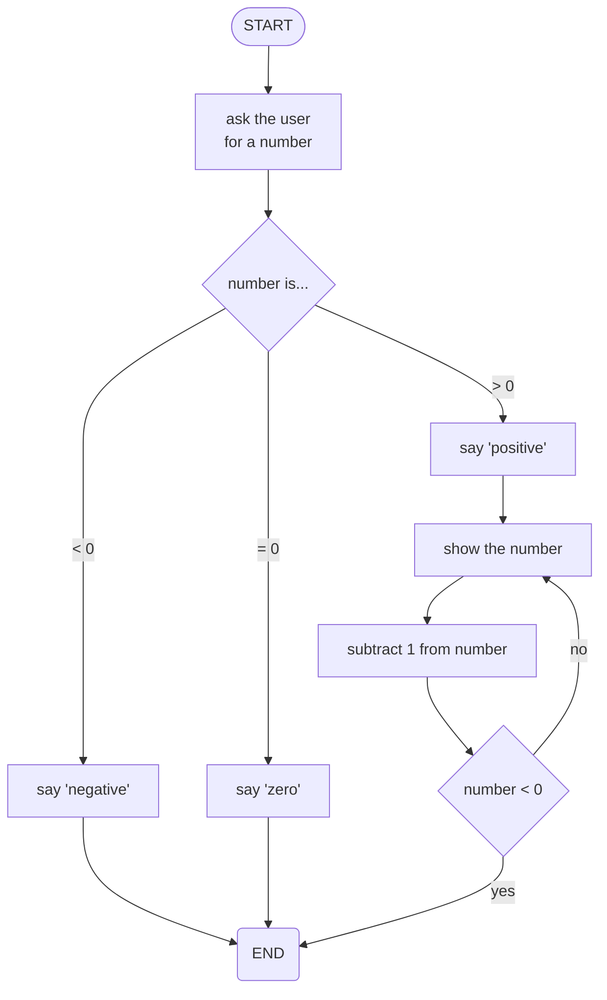
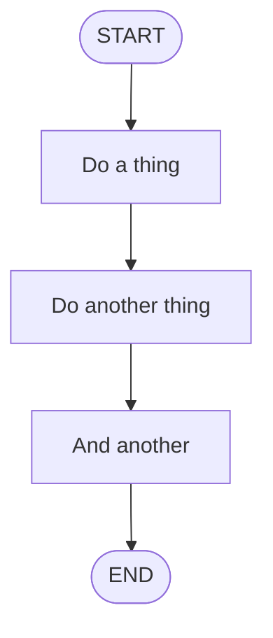
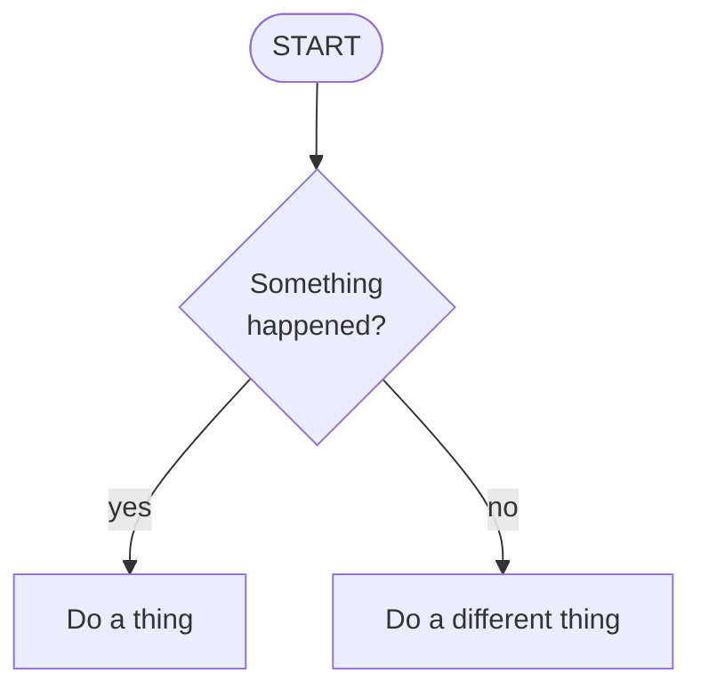
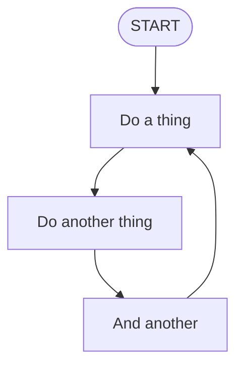
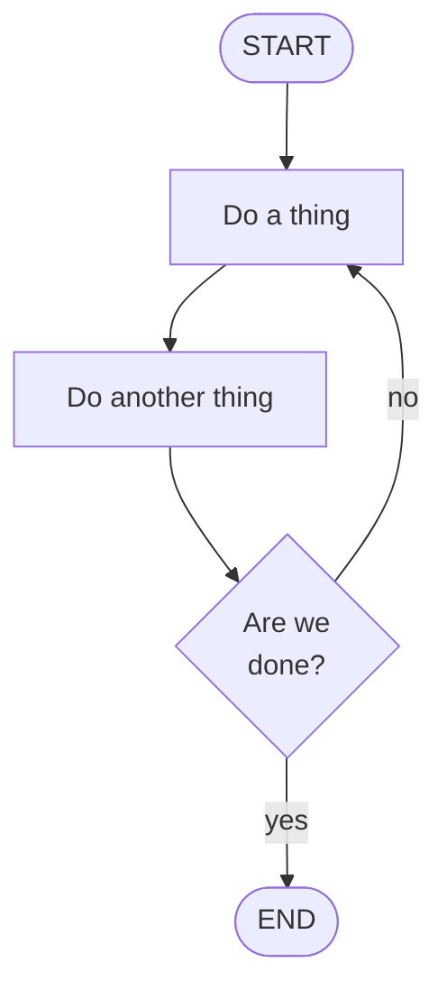
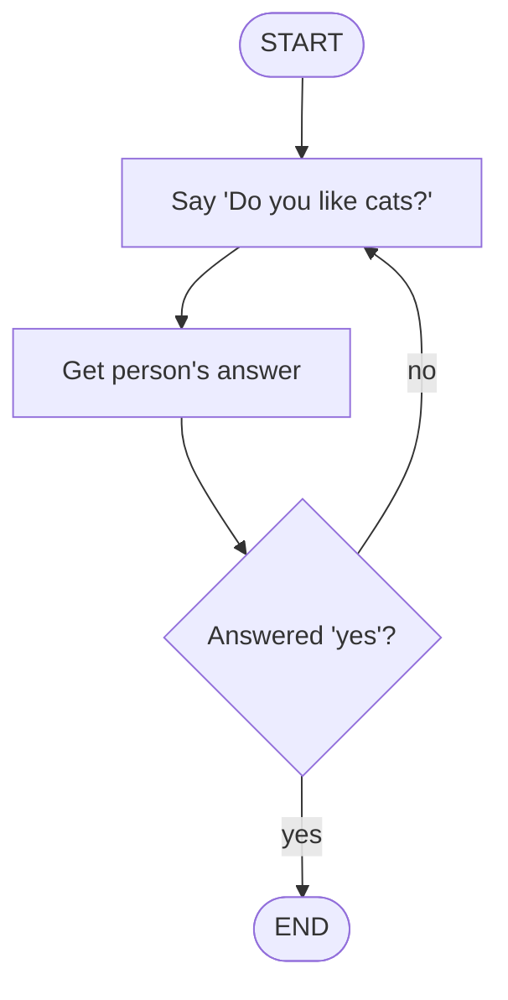
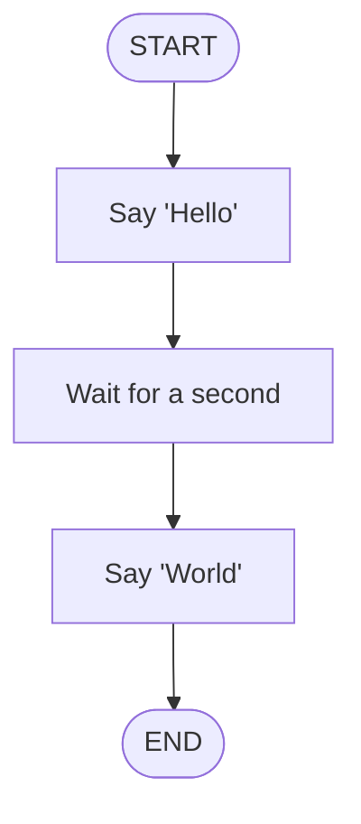
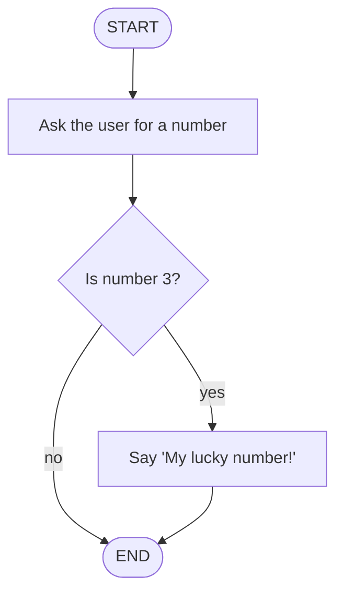
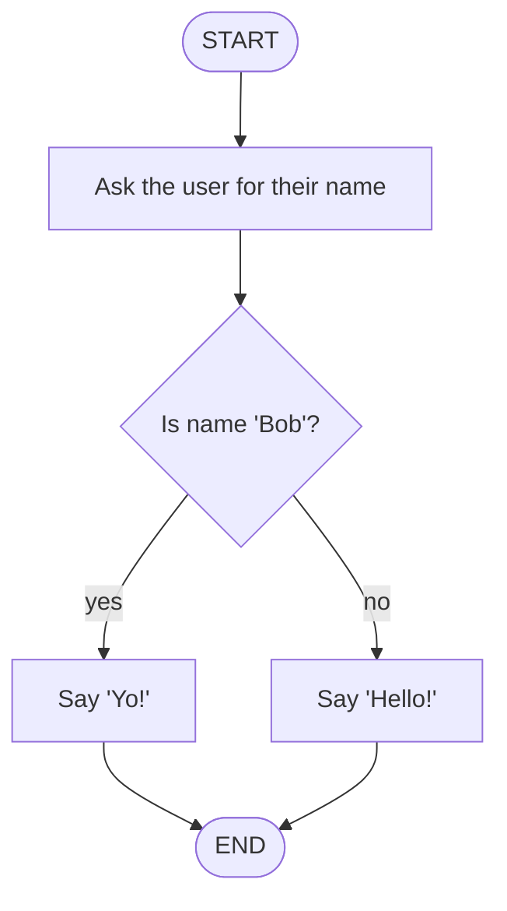
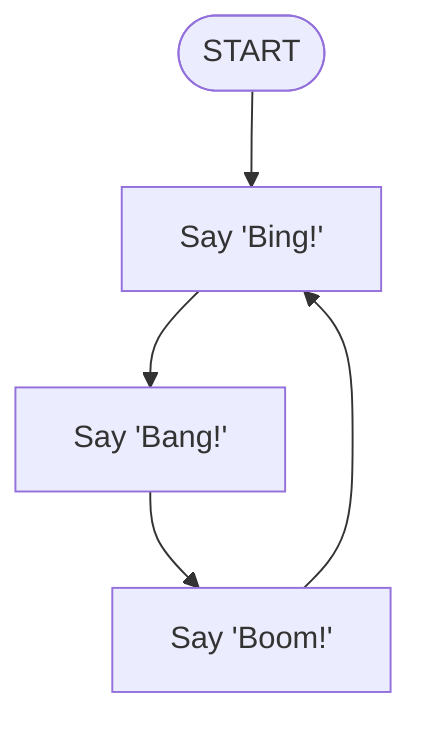

# Algorithm Basics

--
pseudo

-----------------------------------------------
## Introduction

This is a test...



--

Some pseudocode...

```pseudo
start
  ask user for a number

  if the number is 0 then...
    say the number is zero

  if the number < 0 then...
    say the number is negative

  if the number > 0 then...
    say the number is positive
    repeat this...
      show the number
      subtract 1 from the number
    until number < 0
  end if
end
```


-----------------------------------------------
## Question 1

Take a look at this flowchart:



--
### What Do We Call This?

What is the algorithm feature that is shown?

1. Sequence
2. Iteration / looping
3. Decision / branching

--
An algorithm, at its most simple, is just a **sequence** of steps that are followed *in-order*, from `START` to `END`.


-----------------------------------------------
## Question 2

Take a look at this flowchart:


--
### What Do We Call This?

What is the algorithm feature that is shown?

1. Branching / decision
2. Iteration / looping
3. Sequence

--
Whenever the flow of an algorithm *splits* into two or more paths, we call this a **decision**, or more formally, **branching**.


-----------------------------------------------
## Question 3

Take a look at this flowchart:



--
### What Do We Call The Diamond?

What does the diamond block represent? What do we call the check / question that controls the flow?

1. Condition
2. Iteration / looping
3. Sequence

--
Whenever the flow of an algorithm *splits* into two or more paths, it is controlled by a question, or a test. The subject of the question or test is call the **condition** and it controls which path will be taken.

Conditions can be complex, involving multiple *criteria* linked by *logical operators*, such as **AND** or **OR**, e.g. `is (DAY=Mon OR DAY=Tue) AND time>12:00 ?`


-----------------------------------------------
## Question 4

Take a look at this flowchart:



--
### What Do We Call This?

What is the algorithm feature that is shown?

1. Iteration / looping
2. Decision / branching
3. Sequence

--
Whenever the flow of an algorithm goes back to a previous step, creating a *loop* in the flow, we call this **looping**, or more formally, **iteration**.


-----------------------------------------------
## Question 5

Take a look at this flowchart:


--
### How Many Times?

How mant times will the algorithm repeat?

1. It will never stop (infinite)
2. It will stop after a certain time
3. It will stop after a certain number of repeats

--
This particular type of *loop* is called an **inifinte loop** since there is no way of exiting the loop - no *condition* that stops it repeating.

Once the lopp starts, it will go round, and round, and round, and round... forever!


-----------------------------------------------
## Question 6

Take a look at this flowchart:



--
### What Do We Call This?

There is a loop here, but there is also branch out of the loop. What do these two things make when used together like this?

1. Conditonal loop
2. Infinite loop
3. Free loop

--
This particular type of *loop* is called a **conditonal loop** since there is a particular *condition* that will eventually stop it repeating.

Once the lopp starts, it will go round, and round, but as soon at the *condition* is **true** / **yes**, it will stop looping.


-----------------------------------------------
## Question 7

Take a look at this flowchart:



--
### How Many Times?

How mant times will the algorithm ask the question?

1. At least once, but could be many more times
2. It will never stop (infinite)
3. It will ask ten times

--
To exit this *conditonal loop*, the condition must be met... And that means the person must say *yes*.

So the question will be asked *at least once*, but it could be many more if the person doesn't like cats!


-----------------------------------------------
## Question 8

Take a look at this algorithm in flowchart form:



--
### Which Code Matches?

Which of these pseudocode snippets represents that same algorithm?

1.
  ```pseudo
  start
    say 'Hello'
    wait for a second
    say 'World'
  end
  ```

2.
  ```pseudo
  start
    say 'Hello'
    wait for a second
    say 'World'
    wait for a second
  end
  ```

3.
  ```pseudo
  start
    say 'World'
    wait for a second
    say 'Hello'
  end
  ```

--
Yes


-----------------------------------------------
## Question 9

Take a look at this algorithm in flowchart form:



--
### Which Code Matches?

Which of these pseudocode snippets represents that same algorithm?

1.
  ```pseudo
  start
    ask 'Enter a number'
    if number is 3 then
      say 'My lucky number!'
    endif
  end
  ```

2.
  ```pseudo
  start
    ask 'Enter a number'
    say 'My lucky number!'
  end
  ```

3.
  ```pseudo
  start
    ask 'Enter a number'
    say 'My lucky number!'
    if number is 3 then
      end
    endif
  end
  ```

--
Yes


-----------------------------------------------
## Question 10

Take a look at this algorithm in flowchart form:



--
### Which Code Matches?

Which of these pseudocode snippets represents that same algorithm?

1.
  ```pseudo
  start
    ask 'What is your name?'
    if answer is 'Bob' then
      say 'Yo!'
    else
      say 'Hello!'
    endif
  end
  ```

2.
  ```pseudo
  start
    ask 'What is your name?'
    say 'Yo!'
    if answer is 'Bob' then
      say 'Hello!'
    endif
  end
  ```

3.
  ```pseudo
  start
    ask 'What is your name?'
    if answer is 'Bob' then
      say 'Yo!'
    endif
    say 'Hello!'
  end
  ```

--
Yes


-----------------------------------------------
## Question 11

Take a look at this algorithm in flowchart form:



--
### Which Code Matches?

Which of these pseudocode snippets represents that same algorithm?

1.
  ```pseudo
  start
    repeat forever
      say 'Bing!'
      say 'Bang!'
      say 'Boom!'
    endrepeat
  end
  ```

2.
  ```pseudo
  start
    say 'Bing!'
    say 'Bang!'
    say 'Boom!'
  end
  ```

3.
  ```pseudo
  start
    if then
      say 'Bing!'
      say 'Bang!'
      say 'Boom!'
    endif
  end
  ```

--
Yes


-----------------------------------------------
## Question 11

Take a look at this algorithm in flowchart form:


--
### Which Code Matches?

Which of these pseudocode snippets represents that same algorithm?

1.
  ```pseudo
  start
    repeat
      say 'Do you like cats?'
      get user's answer
    until answer is 'yes'
  end
  ```

2.
  ```pseudo
  start
    say 'Do you like cats?'
    get user's answer
    if answer is 'yes'
  end
  ```

3.
  ```pseudo
  start
    if answer is 'yes'
      say 'Do you like cats?'
      get user's answer
    endif
  end
  ```

--
Yes

