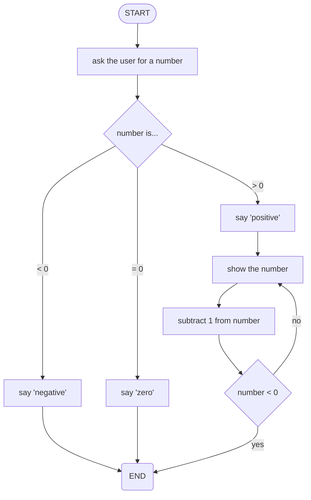
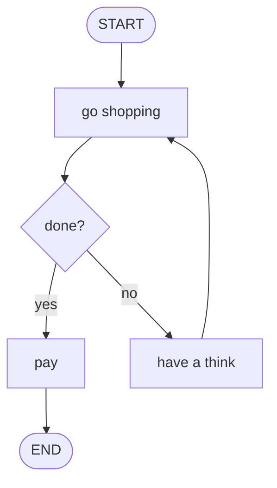

# Algorithms

--
mermaid

-----------------------------------------------
## Introduction

This is a test...



--

Some pseudocode...

```pseudo
start
  ask user for a number

  if the number is 0 then...
    say the number is zero
  
  if the number < 0 then...
    say the number is negative

  if the number > 0 then...
    say the number is positive
    repeat this...
      show the number
      subtract 1 from the number
    until number < 0
  end if
end
```


-----------------------------------------------
## Question 1

Look at this:




--
### What?

1. Thing
2. Stuff

--
Yes!


